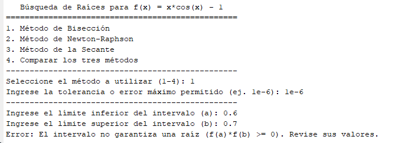
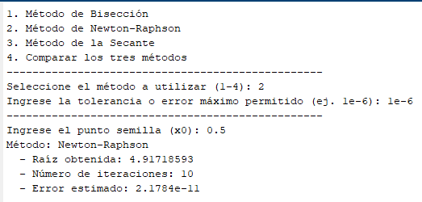
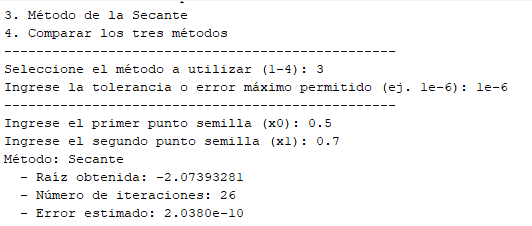
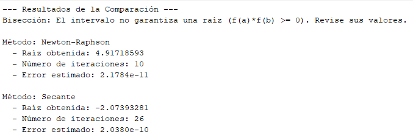

# RESULTADOS DE LOS CÓDIGOS

## SEMANA 6 - RAICES DE ECUACIONES

Trabajo en clase:

- Para el método de Bisección:

- Para el método de Newton-Raphson:

- Para el método de la Secante:

- La comparación de los métodos:

Conclusión: En cuanto a número de iteraciones, el método de Newton-Raphson converge más rápido con 10 iteraciones, siguiéndole el método de la Secante con 26, mientras que en el de Bisección no existe un cambio de signo que permita hallar una raíz en dicho intervalo.

La razón por la cual el método de Newton-Raphson converge más rápido es porque al acercarse a la raíz el error se reduce a su cuadrado con cada iteración, esto por usar derivada exacta mientras que la secante al usar una aproximación en elementos finitos es más lenta esta reducción.
